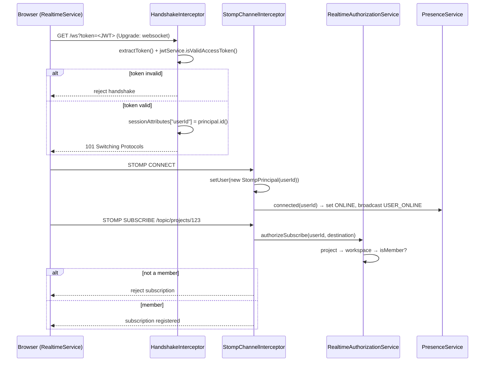
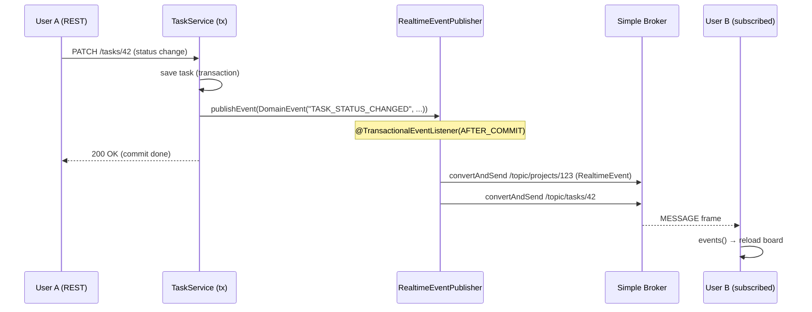
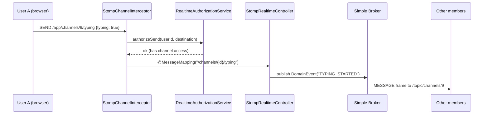
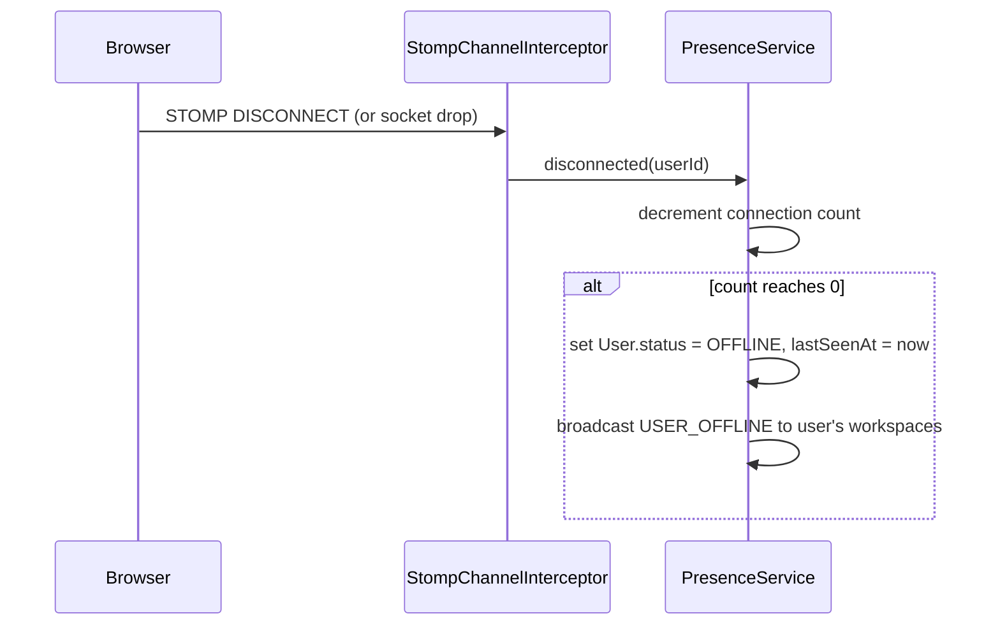

# Realtime (WebSocket / STOMP)

This document explains the real time subsystem: the STOMP-over-WebSocket protocol
flow, the security model, the event pipeline, and the frontend client lifecycle
(including reconnect/backoff).

Companion doc: [`ARCHITECTURE.md`](./ARCHITECTURE.md) (see §8 Realtime).

---

## 1. Components

| Component | Location | Role |
|---|---|---|
| `WebSocketConfig` | `backend/.../config/WebSocketConfig.java` | Registers `/ws`, broker, prefixes |
| `WebSocketHandshakeInterceptor` | `backend/.../realtime/` | Authenticates the connection during the HTTP handshake |
| `StompChannelInterceptor` | `backend/.../realtime/` | Authorizes CONNECT/SUBSCRIBE/SEND, presence |
| `RealtimeAuthorizationService` | `backend/.../realtime/` | Destination-level membership checks |
| `PresenceService` | `backend/.../presence/` | Online/offline + presence broadcast |
| `StompRealtimeController` | `backend/.../realtime/` | Handles inbound `/app/**` messages |
| `DomainEvent` | `backend/.../common/event/` | Domain event envelope |
| `RealtimeEventPublisher` | `backend/.../realtime/` | Publishes `DomainEvent`s over the broker |
| `RealtimeService` | `frontend/.../core/services/realtime.service.ts` | STOMP client (connect/subscribe/send/reconnect) |

## 2. STOMP destination prefixes

```java
registry.enableSimpleBroker("/topic", "/queue");      // server → clients
registry.setApplicationDestinationPrefixes("/app");    // clients → server
registry.setUserDestinationPrefix("/user");            // per-user queues
```

| Prefix | Direction | Meaning |
|---|---|---|
| `/app/**` | client → server | inbound messages (`@MessageMapping`) |
| `/topic/**` | server → clients | broadcast channels (subscriptions) |
| `/user/queue/**` | server → one user | private queue (notifications) |

---

## 3. Connection & subscription



**Details**

- The JWT is passed as a query param (`?token=`), because browsers cannot set
  custom headers on the native `WebSocket` handshake.
- The validated `userId` is stashed in the session attributes by the handshake
  interceptor and later read by the channel interceptor (`readUserId()`).
- Every `SUBSCRIBE`/`SEND` is re-authorized per destination (workspace/project/
  task/channel membership). `/user/**` is always allowed (it is the user's own queue).

---

## 4. Outbound event (e.g. a task status change)



**Routing rules** (in `RealtimeEventPublisher.publish`):

- `recipientId` set → `convertAndSendToUser(..., "/queue/notifications", ...)`
- `workspaceId` set → `/topic/workspaces/{workspaceId}`
- `projectId` set → `/topic/projects/{projectId}`
- `TASK_*` / `COMMENT_*` → additionally `/topic/tasks/{resourceId}`
- `MESSAGE_*` / `TYPING_*` → additionally `/topic/channels/{resourceId}`

The listener uses `@TransactionalEventListener(phase = AFTER_COMMIT)`, so clients
are notified **only after** the DB transaction commits — no events for changes
that get rolled back.

---

## 5. Inbound message (typing indicator)



---

## 6. Disconnect & presence



Presence uses a `ConcurrentHashMap<UUID, AtomicInteger>` of connection counts, so
multiple tabs per user are handled correctly (OFFLINE only when the last tab closes).

---

## 7. Frontend client lifecycle (`RealtimeService`)

The frontend uses `@stomp/stompjs` `Client` with a single shared instance.

### 7.1 State machine

```
DISCONNECTED ──connect()──► CONNECTING ──onConnect──► CONNECTED
     ▲                        │                           │
     │                        └───────────onWebSocketError─┴─► ERROR
     │                                        (socket closes)
     │                                              │
     └───────disconnect()◄── RECONNECTING ◄─────────┘  (onWebSocketClose)
```

Tracked in a signal `state`, exposed to the UI (topbar shows "Live" / "Connecting…").

### 7.2 Connect

```ts
brokerURL: `${environment.wsUrl}?token=${token}`,
reconnectDelay: 1000,
```

- Only connects if an access token exists (`tokenService.getAccessToken()`).
- The token is captured **at connect time**. If it expires during a long-lived
  connection, a manual reconnect is required to pick up the refreshed token.

### 7.3 Reconnect with exponential backoff

```ts
onWebSocketClose: () => {
  if (state === 'CONNECTED') state.set('RECONNECTING');
  client.reconnectDelay = backoffDelay();
}

backoffDelay() {
  reconnectAttempt += 1;
  const base = Math.min(Math.pow(2, reconnectAttempt), 30) * 1000;
  return Math.min(base, 30000);
}
```

Effective delay sequence (capped at 30 s):

| Attempt | Delay |
|---|---|
| 1 | 2 s |
| 2 | 4 s |
| 3 | 8 s |
| 4 | 16 s |
| 5+ | 30 s |

### 7.4 Subscribe & resubscribe

- `subscribeToTopic(destination)` records the topic in a `Set` (`desiredTopics`)
  and calls `trySubscribe()`.
- `trySubscribe()` only subscribes while `client.connected` and not already
  subscribed (dedupe via `subscriptions` map).
- On every successful (re)connect, `resubscribeAll()` re-subscribes to every
  topic in `desiredTopics` — so subscriptions survive reconnects.

### 7.5 Message handling

```ts
client.subscribe(destination, (message) => handleMessage(message));

handleMessage(message) {
  const event = JSON.parse(message.body) as RealtimeEvent;
  this.eventsSubject.next(event);   // RxJS Subject → components
}
```

Components subscribe to `events()` (an `Observable<RealtimeEvent>`) and react —
e.g. the task board reloads on `TASK_*`, the task detail reloads on `COMMENT_*`,
and the shell increments the unread badge on `NOTIFICATION_CREATED`.

---

## 8. Gotchas / limitations

- **Simple broker is single-instance.** Events don't cross to other backend
  instances; the same applies to `PresenceService`'s in-memory counters. Scaling
  out requires a shared broker/fan-out (e.g. Redis pub/sub — see the architecture
  discussion).
- **Token in query string** — required because browsers can't set WS handshake
  headers; it can appear in server logs.
- **Token expiry on long-lived sockets** — the connection keeps the original
  token; a full reconnect is needed after a refresh.
- **`@TransactionalEventListener(AFTER_COMMIT)`** — intentional, so realtime
  messages never reflect uncommitted (or rolled-back) state.
- **`@Lazy SimpMessagingTemplate`** — avoids a startup circular dependency with
  the messaging infrastructure.
